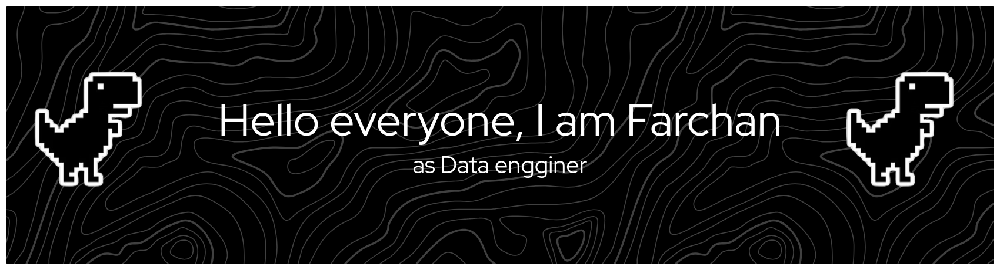

#### A tech-savvy fresh graduate *passionate about Web Development, Data Engineering and Automation*. I am driven to transform raw data into meaningful insights and *passionate about building systems that make workflows more efficient*.

### 🛠 Tech Stack

### 💼 Experience
* **IT Support Intern | PT Inofastama Cakrawala Teknologi** (2.5 Months) - 2019
  * Technical Support & Maintenance: Managed the installation, configuration, and troubleshooting of Windows operating systems,       ensuring operational stability and optimal performance for devices within the MPR/DPR environment.

  * Server & Infrastructure Support: Assisted in the maintenance and monitoring of server environments to ensure high                 availability    and stability, including performing routine server checks and basic administration tasks.
  
  * IT Asset Management & Audit: Conducted periodic audits of IT assets, identifying systems requiring OS upgrades or hardware        replacements, and maintained detailed documentation to streamline asset lifecycle management.
  
* **CMS Specialist Intern | PT Millenials Indonesia Berkarya** (2 Months) 2024
  * Digital Content Optimization: Managed and structured digital content within the Content Management System (CMS), ensuring         data accuracy, structural integrity, and seamless accessibility for end-users.

  * Data Integrity & Quality Assurance: Performed systematic data validation to maintain information consistency and prevent          input errors within the content database.

  * System Usability Enhancement: Analyzed content access workflows to optimize system navigation, which significantly improved       data retrieval efficiency for internal stakeholders and end-users.

### 🎓 Certifications
* 🏆 **Code Generation and Optimization using IBM Granite** – [*Click this*](https://www.credly.com/badges/6f46b80a-c252-4ab7-8f58-1f0594f5e997)
  
### 🎓 Education
* Universitas Bina Sarana Informasi | Indonesia | Kota Bekasi |  2021-2026
* Bachelor of Information Technology (S.Kom)

### 🚀 Personal Projects
* **[Regular Show Episode Scraper]**: Developed a Python-based web scraper to collect TV show episode data from Wikipedia, cleaned the data using Pandas, and exported it to CSV.

---

### 📈 Currently Learning
* **Advanced Data Engineering pipelines**.
* **Deepening skills in SQL databases & Cloud integration**.
* **Developing more robust automated scraping tools**.

### 📫 Let's Connect!

---

## 📫 How to reach me
- 

- Gmail    : **farchan193@gmail.com**
